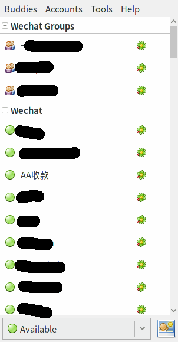
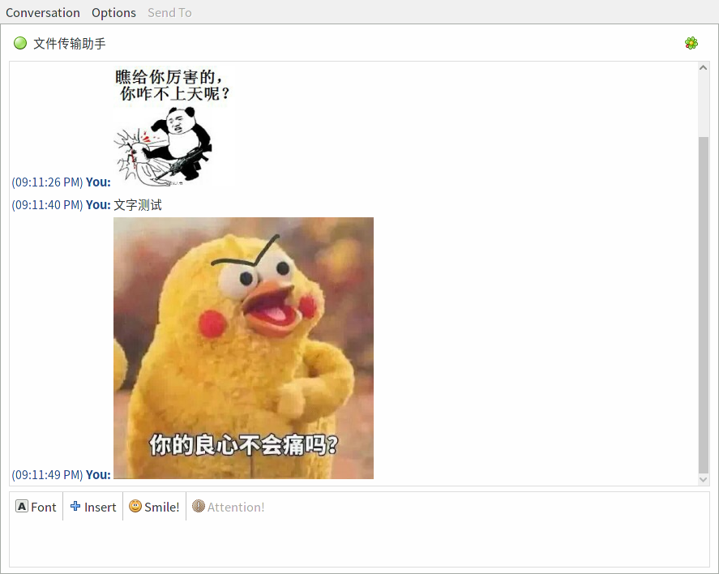

# Pidgin-wechat
`pidgin-wechat` 是一个用微信网页版接口实现 `pidgin` 聊天协议的插件。目前支持联系人聊天、群聊天等功能，并支持图片消息的接收。

## 截图
 


## 构建
使用 `Cargo` 可以很方便的构建本项目。
```
cargo build --release
```

## 安装
`pidgin` 的插件只需要把对应的库文件拷贝到插件目录，重新运行 `pidgin` 即可。
```
cp target/release/libwechat.so ~/.purple/plugins/
```

## 项目进展
目前还在技术验证阶段，暂时实现了基本的登录和消息的收发（图片仅接收），下一步准备支持用户头像。

## 开发进度
- [x] 登录
- [x] 收发文字消息
- [x] 收发群聊天消息（Bugs: [#1](https://github.com/sbwtw/pidgin-wechat/issues/1) [#2](https://github.com/sbwtw/pidgin-wechat/issues/2)）
- [x] 显示图片消息
- [x] 显示自定义表情
- [ ] 发送文件与图片
- [ ] 用户头像
- [ ] 公众号
- [ ] 表情

## Hack
目前遇到最多的问题是：
- 登录失败，此时终端会输出很多 1101 字样的消息，重新登录即可，常出现在短时间重复登录。
- 接收消息时崩溃（无新消息响应），容易在网络环境较差的时候出现，目前没有实现重传机制，需要重新登录。

可以使用 `cargo build` 来生成 debug 版本的库文件，在 `target/debug/` 目录下。

pidgin-wechat 的日志目前是输出到标准输出上的，可以在终端中启动 pidgin，就可以看到日志。

如果遇到崩溃问题，可以使用 `coredumpctl -1 info pidgin` 来输出 pidgin 的 core dump 信息（确保安装了 systemd 的 coredump 相关包），这将对定位问题十分有用。如果没有 coredump，请使用 `gdb` 获取相关信息。

## 协议
