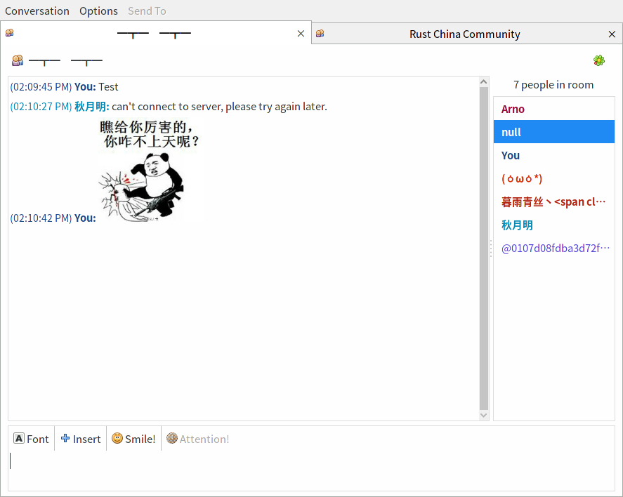

# About Pidgin-wechat
`pidgin-wechat` is a protocol plugins for `pidgin/libpurple`, It's based on Web Wechat and support basic message receive and picture receive.

## Screenshot



## Build
You can using `cargo` to build it.
```
cargo build --release
```

### Build dependencies
- clang
- libpurple (develop package)

> build depends maybe not fully listed, I have just test on Archlinux with nightly rust complier.

> You can download the complied binary file in [Releases](https://github.com/sbwtw/pidgin-wechat/releases/) page.

## Install
If you build using `cargo`, the binary file is placed at `target/release` or `target/debug` directory.

To install this plugin, just need to copy to your plugins direcotry and restart `pidgin`.
```
mkdir -p ~/.purple/plugins
cp -f libwechat.so ~/.purple/plugins/
```

## Roadmap
Now this project is still in technical validation, I need to test some wechat feature and thinking about how to implement it in pidgin.

## Progress
- [x] login
- [x] send/receive text message
- [x] send/receive text message in group chat
- [x] receive image message
- [x] receive custom sticker
- [ ] upload file & image
- [ ] buddy icon
- [ ] wechat official accounts
- [ ] rich text message
- [ ] voice message
- [ ] built in sticker
- [ ] system message notify

## Hack
Most common problems:
- login failed, you can see 1101 error code at your terminal, need to relogin.

the log of `pidgin-wechat` is print into standard output, need to start pidgin in your terminal, and then you can see it.

if it's crashed, you can use `coredumpctl -1 info pidgin` to check core dump info, it's very useful to find out problem.(ensure you are installed coredump package)

### File list
```
.
├── Cargo.lock
├── Cargo.toml
├── README.md
├── screenshot
│   ├── 2017-04-13-211208_887x708_scrot.png
│   └── 2017-04-13-211409_302x579_scrot.png
└── src
    ├── chatroom.rs                                 struct of chatroom infomation
    ├── message.rs                                  struct of message
    ├── pointer.rs                                  a wrapper of raw C pointer
    ├── server.rs                                   core protocol file
    ├── user.rs                                     struct of user infomation
    └── wechat.rs                                   core pidgin interface file
```

## Q&A
### Why using pidgin/libpurple?
The version of desktop wechat implementation has already exists and maybe has modern UI, but I want to login all my IMs in same tool(like IRC, MSN, etc). so I choose pidgin because it's support a lot of chat protocol.

### Is red packet/custom sticker supported?
Not supported. because this program is base on web wechat protocol, so these feature if web wechat is not support, we can't either.

## LICENSE
This project is licensed under __WTFPL__.
